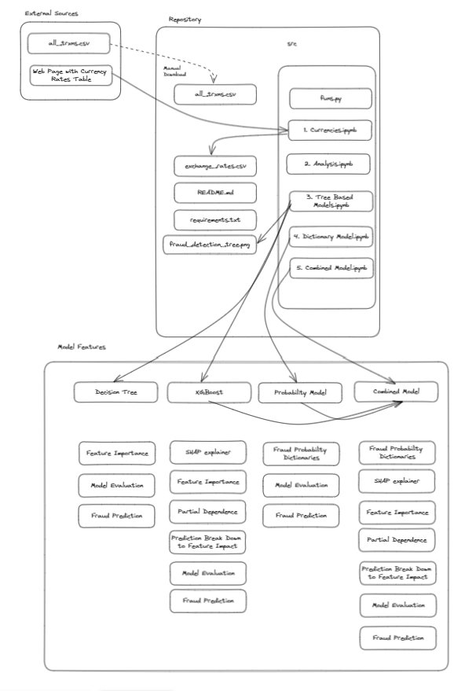

# Fraud-Detection
The aim of this project is to build a model that can accurately identify fraudulent or suspicious transactions in financial datasets, which is crucial for ensuring financial security and reducing fraudulent activities.

## Dataset

This dataset contains information on transactions made by various customers with various counter parties. Each row in the dataset represents a single transaction and contains the following variables:

- `customer`: A unique identifier for the customer making the transaction
- `customer_country`: The country where the customer making the transaction is located
- `fraud_flag`: A binary variable indicating whether the transaction has been labeled as fraudulent or suspicious
- `timestamp`: The date and time of the transaction
- `counterparty`: A unique identifier for the counterparty in the transaction
- `counterparty_country`: The country where the counterparty in the transaction is located
- `type`: A categorical variable indicating the type of transaction (e.g., payment, transfer, billing)
- `ccy`: The currency used in the transaction
- `amount`: The amount of money involved in the transaction (in the currency specified in the currency variable).

Download the raw file from Google Drive: https://drive.google.com/drive/folders/1qXdsZYb3NNhb3V_ABAoy0wAO0EZyIU-S

 

## Requirements

This project requires `Python 3.10.5` or later. You can download Python from the official website: https://www.python.org/downloads/

 

### Installing Dependencies

All required dependencies for this project are listed in the requirements.txt file. To install these dependencies, run the following command in your terminal:

> pip install -r requirements.txt

 

### Virtual Environment

It is recommended to use a virtual environment to manage dependencies for your project. To create and activate a virtual environment in Python, follow these steps:

1. Open a terminal and navigate to the root directory of the project

2. Run the following command to create a virtual environment named venv:
> python3 -m venv venv

Note: python3 may need to be replaced with python depending on your system configuration

3. Activate the virtual environment with the following command:
> source venv/bin/activate

4. Install the dependencies as described above

By using a virtual environment, you can ensure that the dependencies for this project do not interfere with other Python projects on your system.

 

## Repository Structure

The repository contains a collection of Jupyter notebooks and Python scripts that were used to train and evaluate a machine learning model for fraud detection in financial transactions.

The main files in the repository are:

- `src/funs.py`: This Python script contains customized functions used throughout the project.
- `src/1. Currencies.ipynb`: This notebook collects the currency conversion rates from the static table on the website and saves the data to a CSV file that is used in the solution.
- `src/2. Analysis.ipynb`: This notebook contains an initial data exploration and analysis to gain an understanding of the data. It includes steps such as identifying the number of fraud cases, performing a chi-squared test to identify variables associated with fraud, and using visualization techniques to identify factors within variables associated with fraud. One-hot encoding and ANOVA F-test techniques are also applied to the data in this notebook.
- `src/3. Tree Based Models.ipynb`: This notebook builds and explains the decision tree and XGBoost models. The notebook includes steps such as performance evaluation, feature importances, and plotting the decision tree.
- `src/4. Linear Programming Model.ipynb`: This notebook contains an algorithm based on dictionaries and performs a series of steps to find the best thresholds for expected fraud probability, standard deviation flags, and quantile flags. The notebook evaluates the model using the training and test data sets.

The project's workflow is shown in the following diagram:

